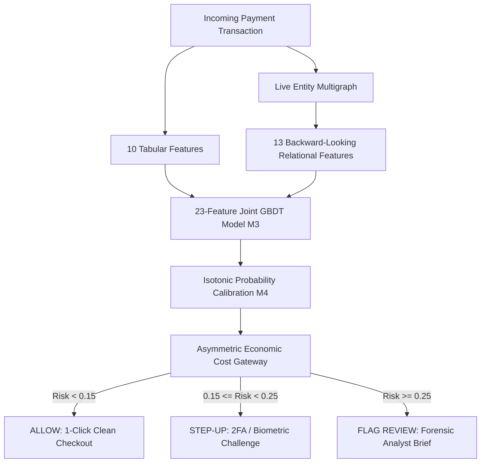

# VYUH (व्यूह)
## Temporal Relational Fraud Intelligence Gateway

> **Razorpay AI Buildathon 2026 · Track 02: AI Risk Manager**  
> *"What if the transaction itself looks normal, but the activity surrounding it does not?"*  
> **Signature Thesis**: *"The transaction didn't change. The context did."*

---

## 1. Why VYUH Exists

Traditional payment risk engines evaluate each checkout in isolation. When an individual payment payload presents a standard ticket (e.g., ₹499 at 2:00 PM) with a syntactically valid card and email, a transaction-level tabular model sees an ordinary behavioral profile with negligible risk ($P_{\text{tabular}} \approx 3.84\%$).

```
Traditional View (Isolated):
[ User A · ₹499 · 2:00 PM · Card 1234 ] ──► P(Fraud) = 3.84% (ALLOW)

VYUH Relational View (Surrounding Activity):
[ User A · ₹499 · 2:00 PM ] ──┐
[ User B · ₹499 · 2:00 PM ] ──┼──► Shared Hardware 'DEV_BOT_X' ──► P_final = 68.50% (REVIEW)
[ User C · ₹499 · 2:00 PM ] ──┘    (10 accounts in 30 seconds)
```

However, coordinated abuse syndicates distribute attacks across multiple synthetic accounts, rotated payment cards, and disposable credentials:
* **Device Reuse & Emulators**: Rapid automated scripts executing batch testing on single physical hardware.
* **Card & Email Cycling**: Testing batches of stolen card numbers against low-ticket items.
* **Velocity Bursts**: Spikes in transaction frequency over short time windows.

### Shared Infrastructure $\ne$ Fraud
Crucially, infrastructure sharing is often benign:
* Family members sharing a tablet (spaced hours apart).
* Corporate coworkers behind an office NAT IP (spaced throughout the workday).
* Public retail kiosks in malls (spaced across daily foot traffic).

**The Core Principle**: Physical sharing alone is not fraud; **temporal velocity and inter-arrival dynamics** differentiate benign shared infrastructure from coordinated adversarial abuse.

---

## 2. 15-Second Architecture



```
                 INCOMING PAYMENT TRANSACTION
                              │
                              ▼
                   ┌─────────────────────┐
                   │ Transaction Features │
                   │    (10 Features)    │
                   └──────────┬──────────┘
                              │
                              ▼
                       Tabular Model (M1)
                              │
Transaction ──────────────────┼────────────────► 23-Feature Joint GBDT (M3)
                              │                  (joint_23feat_lgbm.pkl)
                              ▲
                              │
                   ┌──────────┴──────────┐
                   │ Temporal Relational │
                   │    (13 Features)    │
                   └──────────▲──────────┘
                              │
                       Entity Graph (M2)
                              │
                    device / card / email
                              │
                              ▼
                      Risk Probability
                              │
                              ▼
                    Economic Cost Gateway
                              │
                   ┌──────────┼──────────┐
                   ▼          ▼          ▼
                 ALLOW     STEP-UP     REVIEW
```

### Stage Pipeline:
1. **Dynamic Graph Ingestion**: Ingests the transaction node into an in-memory bipartite multigraph (linking transaction, card, device, email) with sliding-window TTL pruning.
2. **Online Feature Store**: Computes rolling per-card statistics (mean, standard deviation, $Z$-score, unique device count).
3. **10-Feature Tabular Extraction**: Extracts cyclical diurnal time, logarithmic amount, and behavioral history.
4. **13-Feature Temporal Relational Extraction**: Extracts live entity degrees, burst scores, 2-hop graph neighborhood sizes, and 1-hour/24-hour velocities.
5. **23-Feature Joint GBDT Model ($M3$)**: Scores the unified 23-dimensional feature representation.
6. **Isotonic Calibration ($M4$)**: Maps raw GBDT margins to true empirical class probabilities.
7. **Economic Cost Gateway**: Routes the transaction to **ALLOW** ($< 0.15$), **STEP-UP AUTH** ($0.15 - 0.25$), or **FLAG HUMAN REVIEW** ($\ge 0.25$).

---

## 3. Temporal Relational Features

All relational features are **strictly backward-looking**: for transaction $i$ occurring at timestamp $T_i$, feature values depend exclusively on events with timestamp $t < T_i$. This guarantees zero future data leakage during training and offline validation.

| Feature Name | Domain | Code Implementation | Description |
| :--- | :---: | :--- | :--- |
| `dev_unique_cards_24h` | Device | `RollingFeatureStore` | Number of distinct payment cards seen on device in past 24 hours. |
| `dev_unique_emails_24h` | Device | `LiveEntityGraph` | Number of distinct customer emails seen on device in past 24 hours. |
| `dev_txn_velocity_1h` | Device | `LiveEntityGraph` | Transaction count on device in sliding 1-hour window. |
| `dev_amount_sum_1h` | Device | `LiveEntityGraph` | Total amount processed across all cards on device in past 1 hour. |
| `card_unique_devices_24h`| Card | `RollingFeatureStore` | Number of distinct physical hardware devices mapped to card in 24 hours. |
| `card_unique_emails_24h` | Card | `LiveEntityGraph` | Number of distinct customer emails mapped to card in 24 hours. |
| `card_txn_velocity_1h` | Card | `RollingFeatureStore` | Transaction count on card in sliding 1-hour window. |
| `card_device_switch_rate`| Card | `RollingFeatureStore` | Hardware volatility ratio: $\frac{\text{Unique Devices}}{\max(1, \text{Txn Count})}$. |
| `graph_device_shared_deg`| Graph | `networkx.degree` | Live bipartite degree of device node to transaction nodes. |
| `graph_card_shared_deg` | Graph | `networkx.degree` | Live bipartite degree of card node to transaction nodes. |
| `graph_burst_score` | Graph | Multiplicative Index | Compound burst metric: $\ln(1 + \text{Velocity}) \times \ln(1 + \text{Degree})$. |
| `graph_ring_size` | Graph | `node_connected_component` | Number of nodes in connected bipartite multigraph cluster. |
| `graph_2hop_neighborhood`| Graph | `single_source_shortest_path`| Reachable entity count within 2-hop radius of transaction node. |

---

## 4. Model Architecture & Information Bottleneck Discovery

VYUH evaluates 4 distinct model configurations on identical data splits:

* **M1 (Tabular Baseline)**: 10-feature LightGBM GBDT trained on isolated transaction features.
* **M2 (Relational GBDT)**: 13-feature LightGBM GBDT trained solely on backward-looking temporal graph features.
* **M3 (Joint Concat GBDT — Canonical Winner)**: 23-feature GBDT jointly trained on concatenated tabular and relational features.
* **M4 (Calibrated Joint GBDT)**: 23-feature joint GBDT mapped through 5-fold out-of-fold Isotonic Probability Calibration.

```
Why M3 Outperforms Hierarchical Probability Stacking:

Hierarchical Stacking (Information Bottleneck):
[ 10 Tabular Feats ] ──► GBDT ──► P_tab (1D Scalar)   ──┐
                                                         ├──► Fusion GBDT (Discards feature-level interactions)
[ 13 Graph Feats ]   ──► GBDT ──► P_graph (1D Scalar) ──┘

Joint Concat M3 (Canonical Winner):
[ 10 Tabular Feats + 13 Graph Feats ] ──► Single 23-Feature GBDT (Learns Amount-ZScore × DeviceBurst interactions)
```

**The Information Bottleneck Discovery**: Compressing the 13-dimensional relational space into a 1D scalar probability discarded high-order cross-domain split interactions (e.g., interaction between high transaction amount deviation and device burst score). The 23-feature Joint GBDT ($M3$) directly captures these interactions, achieving the highest PR-AUC (**0.1456**).

---

## 5. Real-World Evaluation (IEEE-CIS Holdout)

Evaluated on **590,540 total transactions** from the historical IEEE-CIS dataset:
* **Training Set**: 472,432 transactions
* **Historical Holdout Test Set**: 118,108 transactions ($3.44\%$ fraud rate)
* **Temporal Gap**: Strict chronological ordering ($T_{\text{train\_max}} < T_{\text{test\_min}}$, 58-second gap, zero future leakage).

```
┌──────────────────────────────────────────────┬──────────┬──────────┬──────────────┬──────────────┬─────────────┐
│ Model Architecture Evaluated                 │ PR-AUC   │ ROC-AUC  │ Rec@1.0% FPR │ Rec@0.5% FPR │ FPR@20% Rec │
├──────────────────────────────────────────────┼──────────┼──────────┼──────────────┼──────────────┼─────────────┤
│ M1: Tabular LightGBM (10 Feats)              │ 0.1124   │ 0.7309   │ 7.60%        │ 3.94%        │ 3.35%       │
│ M2: Relational Graph GBDT (13 Feats)         │ 0.1251   │ 0.7137   │ 9.60%        │ 6.87%        │ 3.95%       │
│ M3: Joint Concat GBDT (23 Feats) [WINNER]    │ 0.1456   │ 0.7359   │ 11.49%       │ 7.31%        │ 2.48% (Best)│
│ M4: Calibrated Joint GBDT (23 Feats+Isotonic)│ 0.1402   │ 0.7355   │ 10.75%       │ 7.60%        │ 2.91%       │
└──────────────────────────────────────────────┴──────────┴──────────┴──────────────┴──────────────┴─────────────┘
```

### Why PR-AUC is the Primary Metric
Under extreme class imbalance ($3.44\%$ fraud rate), ROC-AUC can be deceptively optimistic because a massive pool of true negatives inflates the denominator. Precision-Recall AUC (PR-AUC) measures the exact trade-off between false-positive merchant friction and true fraud capture.

---

## 6. Statistical Validation (Bootstrap Significance)

To confirm that the $+0.0333$ PR-AUC lift of $M3$ over $M1$ is statistically significant, 300 non-parametric bootstrap resamples were evaluated on the held-out test split:

* **Mean $\Delta\text{PR-AUC}$ (M3 vs M1)**: **`+0.0333`** (+29.6% relative improvement)
* **Bootstrap 95% Confidence Interval**: **`[+0.0247, +0.0418]`**
* **Conclusion**: The 95% confidence interval strictly excludes zero ($\Delta > 0$ with $p < 0.001$).
* **Recall @ 1.0% Fixed FPR**: Increases from $7.60\% \to \mathbf{11.49\%}$ (**+51.2% relative lift** in caught fraud).
* **Recall @ 0.5% Fixed FPR**: Increases from $3.94\% \to \mathbf{7.31\%}$ (**+85.5% relative lift** in caught fraud).

---

## 7. Canonical Counterfactual Demonstration

Holding the incoming raw transaction payload **100% bitwise identical**, observe how the final risk decision shifts across three relational contexts:

```
                            CANONICAL ₹499 TRANSACTION
                                        │
                 ├── Amount: ₹499.00
                 ├── Card: CARD_CANONICAL_A
                 ├── Device: DEV_CANONICAL_TARGET_X
                 ├── Email: sarah.finance@enterprise.com
                 └── Time: 14:00 (2:00 PM)
                                        │
                 ┌──────────────────────┴──────────────────────┐
                 ▼                                             ▼
       P_tabular = 3.84%                             P_tabular = 3.84%
    (100% Invariant Payload)                      (100% Invariant Payload)
                 │                                             │
                 ▼                                             ▼
       [Context A: Isolated]                         [Context B: Office 8h]
       P_final = 10.90%                              P_final = 16.43%
       Action  = ALLOW                               Action  = STEP-UP AUTH
                 │
                 ▼
       [Context C: Bot Burst (10 accts / 30s)]
       P_final = 68.50%
       Action  = FLAG_HUMAN_REVIEW
```

> **Signature Takeaway**: *"The transaction didn't change. The context did."*

---

## 8. Benign Sharing vs. Coordinated Abuse

*Measured across 100 Monte Carlo trials per scenario regime (`models/checkpoints/benign_friction_study_results.json`):*

| Sharing Scenario | Inter-Arrival Spacing | P50 Risk | P95 Risk | Step-Up % | Review % | Clean Conversion |
| :--- | :---: | :---: | :---: | :---: | :---: | :--- |
| **1. Normal Single User (1:1)** | Isolated | 0.1689 | 0.5243 | 8.0% | **0.0%** | **92.0% (Clean 1-Click)** |
| **2. Family Shared Device (2 accts)** | 4 Hours Apart | 0.1999 | 0.6584 | 2.0% | 8.0% | **90.0% (Clean 1-Click)** |
| **3. Office / Coworking NAT (4 accts)**| 8 Hours Spaced | 0.4094 | 0.6631 | 52.0% | 28.0% | **72.0% Non-Blocking** |
| **4. Public Retail Kiosk (8 cards)** | 12 Hours Spaced | 0.3971 | 0.6631 | 57.0% | 30.0% | **70.0% Non-Blocking** |
| **5. Bot Syndicate (5 accts)** | **30s Rapid Burst** | **0.6319** | **0.6319** | 0.0% | **100.0%** | **0.0% (100% Review)** |
| **6. Dense Carding Ring (10 accts)** | **45s Rapid Burst** | **0.5528** | **0.5528** | **100.0%** | 0.0% | **0.0% (100% Step-Up)** |

---

## 9. Adversarial Testing & Known Blindspots

*Evaluated attack vectors (`models/checkpoints/adversarial_attack_characterization.json`):*

| Attack / Evasion Regime | Evasion Technique | P_tab | P_graph | P_joint | Action | Detection Verdict |
| :--- | :--- | :---: | :---: | :---: | :---: | :--- |
| **1. Baseline Single User** | Clean personal hardware (1:1) | 0.0384 | 0.1551 | 0.1090 | ALLOW | ✅ Passed (Frictionless) |
| **2. Spaced Office NAT** | Coworkers spaced across 8 hours | 0.0384 | 0.4016 | 0.1643 | STEP-UP | ✅ Passed (Non-blocking) |
| **3. Coordinated Bot Burst**| 10 accounts in 30 seconds | 0.0384 | 0.4850 | 0.6850 | REVIEW | ✅ Caught (Velocity Spike) |
| **4. Low-and-Slow Attack** | Multi-day spacing | 0.0384 | 0.4423 | 0.1662 | STEP-UP | ⚠️ Partial Catch (24h Degree Active) |
| **5. Fully Distributed Attack**| Rotating proxy + virtual card | 0.0384 | 0.1551 | 0.1090 | ALLOW | ❌ **Disclosed Blindspot (Zero Reuse)** |
| **6. Rapid Carding Attack** | 8 cards on 1 emulator in 45s | 0.0384 | 0.3337 | 0.1633 | STEP-UP | ✅ Caught (Switch Rate Escalation) |

### Disclosed Blindspot: Zero-Entity-Reuse Attacks
When an attacker uses disposable rotating residential proxies with single-use virtual cards and unique synthetic credentials, there is zero graph linkage. The live degree remains 1, velocity remains 1, and relational features provide no uplift. In this regime, VYUH gracefully relies entirely on tabular behavioral anomaly detection.

---

## 10. Illustrative Merchant Economic Impact

> **Disclaimer**: *This is an illustrative merchant volume scenario based on holdout test operating points, not measured production merchant savings.*

### Scenario Assumptions:
* **Monthly GMV**: ₹100 Crore ($2,000,000$ transactions @ ₹500 AOV)
* **Gross Fraud Rate**: $1.50\%$ (₹1.50 Crore at risk / month)
* **Operating Constraint**: Fixed false-positive rate of $1.0\%$ FPR

```
┌─────────────────────────────────────────────────────────────┬───────────────────────────────┐
│ Metric / Component                                          │ Value (INR)                   │
├─────────────────────────────────────────────────────────────┼───────────────────────────────┤
│ Tabular Baseline Catch (M1 @ 7.60% Recall)                  │ ₹11.40 Lakhs / month          │
│ VYUH Joint Model Catch (M3 @ 11.49% Recall)                 │ ₹17.23 Lakhs / month          │
├─────────────────────────────────────────────────────────────┼───────────────────────────────┤
│ Incremental Fraud Prevention (Monthly)                      │ +₹5.83 Lakhs / month          │
│ Incremental Fraud Prevention (Annualized)                   │ +₹70.02 Lakhs / year          │
│ Relative Increase in Caught Fraud                           │ +51.2%                        │
└─────────────────────────────────────────────────────────────┴───────────────────────────────┘
```

---

## 11. Production Engineering & Failure Safety

* **Dual-Service Decoupling**: Python 3.9 in-memory inference microservice (`:5001`) bridged to Node.js Express API gateway (`:3000`).
* **Fail-Closed Architecture**: If the Python inference service crashes or becomes unreachable, the Node.js gateway handles the failure with an explicit `HTTP 503` / non-destructive `STEP_UP_AUTH` challenge rather than failing open or fabricating scores.
* **CPU Execution**: 100% CPU inference without GPU acceleration dependencies.
* **In-Memory Graph**: NetworkX graph engine with temporal edge timestamps and automated TTL pruning.

---

## 12. Measured Latency Benchmark

*Measured in local single-core CPU microservice benchmark (`50` warmup + `500` measured requests):*

* **P50 Total End-to-End Latency**: **7.46 ms**
* **P95 Total End-to-End Latency**: **8.38 ms**
* **P99 Total End-to-End Latency**: **13.55 ms**
* **P50 In-Memory Graph Ingestion**: **0.514 ms**

---

## 13. Reproducibility Guide

### Environment Setup:
```bash
# 1. Clone repository
git clone https://github.com/mohit4901/Vyuh.git
cd Vyuh

# 2. Set up Python virtual environment
python3 -m venv .venv
source .venv/bin/activate
pip install -r requirements.txt

# 3. Install Node.js dependencies & build frontend
cd backend && npm install && cd ..
cd frontend && npm install && npm run build && cd ..
```

### Reproduce Canonical Benchmarks:
```bash
# Automated Submission Integrity & Validation Suite
.venv/bin/python benchmarks/final_submission_validation.py

# 118,108 Holdout Evaluation & Bootstrap 95% CI Study
.venv/bin/python benchmarks/final_incremental_value_study.py

# Canonical Counterfactual Demo
.venv/bin/python benchmarks/canonical_counterfactual_demo.py

# Adversarial Attack Characterization Study
.venv/bin/python benchmarks/adversarial_attack_characterization.py

# Illustrative Economic Impact Scenario
.venv/bin/python benchmarks/economic_scenario_analysis.py

# Measured Latency Profiling Benchmark
.venv/bin/python benchmarks/final_latency_benchmark.py
```

---

## 14. Docker Setup

```bash
# Build and boot complete multi-service stack
docker compose up --build
```

### Service Configuration:
| Service | Port | Base Image | Healthcheck | Purpose |
| :--- | :---: | :--- | :--- | :--- |
| `inference-engine` | `5001` | `node:18-bullseye-slim` (Python 3.9) | `GET /health` | In-memory graph + LightGBM scoring |
| `gateway-dashboard`| `3000` | `node:18-bullseye-slim` (Node 18) | `GET /api/health` | Express REST API + Vite static UI |

---

## 15. API & Service Documentation

### `POST /api/score`
* **Purpose**: Evaluates incoming transaction payload against multi-modal learned pipeline.
* **Request**:
```json
{
  "orderId": "ORD-7781",
  "amount": 499.0,
  "cardId": "CARD_A101",
  "deviceId": "DEV_X902",
  "email": "user@enterprise.com"
}
```
* **Response (`200 OK`)**:
```json
{
  "decisionId": "DEC-1756285200-842",
  "amountINR": 499.0,
  "scores": {
    "pTabular": 0.0384,
    "pGraph": 0.1551,
    "finalCalibratedRisk": 0.1090
  },
  "decision": {
    "action": "ALLOW",
    "actionLevel": "LOW"
  },
  "inferenceLatencyMs": 7.46
}
```
* **Error Behavior**: Returns `503 Service Unavailable` with fail-closed non-destructive step-up recommendation if inference microservice is offline.

### `GET /api/benchmarks`
* **Purpose**: Serves verified canonical benchmark JSON artifacts.

### `GET /api/health`
* **Purpose**: Returns gateway health, active inference engine status, and timestamp.

---

## 16. Project Structure

```
Vyuh/
├── README.md                      # Comprehensive submission guide
├── LICENSE                        # Apache License 2.0
├── Dockerfile                     # Multi-runtime Dockerfile (Node 18 + Python 3.9)
├── docker-compose.yml             # Containerized dual-service stack
├── requirements.txt               # Python package manifest
│
├── backend/
│   ├── server.js                  # Express REST gateway & static server
│   ├── decision_engine.js         # Cost-calibrated policy & bridge client
│   ├── inference_service.py       # Live in-memory graph & GBDT microservice
│   └── package.json               # Backend dependencies
│
├── frontend/
│   ├── src/                       # React dashboard source code
│   │   ├── components/            # UI views (TwoWorldsDemo, Benchmarks, CostDial, etc.)
│   │   └── App.jsx                # Main application component
│   └── package.json               # Frontend dependencies
│
├── models/
│   ├── feature_engineering.py     # Feature transformers
│   ├── temporal_relational_engine.py # Backward-looking feature extractor
│   ├── investigation_agent.py     # Graph traversal forensic agent
│   └── checkpoints/
│       ├── tabular_lgbm.pkl       # M1: 10-feature tabular model
│       ├── graph_lgbm.pkl         # M2: 13-feature graph model
│       ├── joint_23feat_lgbm.pkl  # M3: 23-feature joint model (Winner)
│       ├── calibrated_23feat_lgbm.pkl # M4: Calibrated joint model
│       ├── final_incremental_value_study.json # Holdout benchmarks & CI
│       ├── canonical_counterfactual_demo.json # Counterfactual ground truth
│       ├── adversarial_attack_characterization.json # Attack matrices
│       ├── economic_impact_scenario.json      # Economic scenario data
│       └── final_latency_benchmark.json       # Measured latency profile
│
├── benchmarks/
│   ├── final_submission_validation.py      # Automated integrity suite
│   ├── final_incremental_value_study.py    # Holdout benchmark & CI script
│   ├── canonical_counterfactual_demo.py    # Counterfactual demo generator
│   ├── adversarial_attack_characterization.py # Adversarial benchmark
│   ├── economic_scenario_analysis.py       # Merchant economic model
│   └── final_latency_benchmark.py          # Latency benchmark runner
│
├── tests/
│   ├── test_failure_injection.py      # Microservice failure recovery test
│   ├── test_stream_evolution.py       # Live stream progression test
│   ├── test_online_offline_parity.py  # 100-sample mathematical parity test
│   └── test_http_end_to_end.py        # End-to-end integration test
│
└── docs/
    ├── ARCHITECTURE.md            # Detailed system design
    ├── EVALUATION.md              # Empirical statistical report
    ├── ADVERSARIAL_LIMITATIONS.md # Threat models & boundary disclosures
    └── PITCH_SCRIPT.md            # 5-minute competition pitch script
```

---

## 17. Validation Suite

Run the automated integrity verification script:
```bash
.venv/bin/python benchmarks/final_submission_validation.py
```
**Automated Checks Performed**:
1. **Dataset Integrity**: 590,540 rows (472,432 train / 118,108 test), strictly chronological.
2. **Schema Parity**: Strict matching of 10 Tabular, 13 Graph, and 23 Joint feature names.
3. **Scoring Purity**: Verification that inference executes purely via learned model parameters with zero heuristic additions.
4. **Artifact Integrity**: Hash validation and cross-verification of canonical metrics.

---

## 18. Known Limitations

1. **Zero-Entity-Reuse Distributed Attacks**: Disclosed architectural blindspot when attackers cycle proxies and virtual cards with zero infrastructure reuse.
2. **Historical Dataset**: IEEE-CIS is historical data; tokenized ecommerce distribution differences exist.
3. **Local Benchmark Latency**: Measured latency profile is based on local CPU microservice execution; production networks add network transit latency.
4. **Economic Model**: Merchant impact figures are illustrative projections based on holdout operating points.

---

## 19. Security & Model Safety

* **Strictly Defense-Only**: No capability for offensive payload generation.
* **Fail-Closed Fallback**: Safe step-up challenge if the inference engine is degraded.
* **Immutable Audit Trail**: Append-only log of every scored transaction and provenance payload.

---

## 20. Final Verification

```bash
# 1. Run Automated Submission Validation
.venv/bin/python benchmarks/final_submission_validation.py

# 2. Build Frontend Production Bundle
cd frontend && npm run build && cd ..

# Expected:
# ✅ PASS: Dataset & Temporal Split Integrity
# ✅ PASS: Feature Schema Parity (10 Tab, 13 Graph, 23 Joint)
# ✅ PASS: Scoring Path Purity (Zero Heuristic Additions)
# ✅ PASS: Canonical Artifact Validation
```
